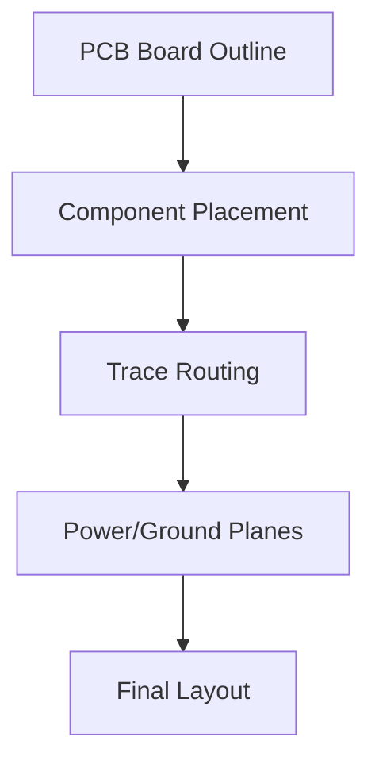

# PCB Layout for Gate Signal to 5V Trigger Converter

## Overview
This is a simple single-sided PCB layout for the circuit described in `gate_trigger_circuit.md`. The board is designed for 5V operation, with dimensions approximately 50mm x 30mm. It uses through-hole components for ease of assembly.

## Components Placement
- **LM393 (U1)**: Positioned at the top-left.
- **NE555 (U2)**: Positioned below U1.
- **Resistors**: R1 (10kΩ), R2 (10kΩ), R3 (100kΩ), R4 (1kΩ), R5 (1kΩ) placed vertically on the right.
- **Capacitors**: C1 (10µF), C2 (0.1µF) near U2.
- **Potentiometer (RV1, 10kΩ)**: At the bottom for threshold adjustment.
- **Power and I/O**: 5V input, GND, Gate Input, Trigger Output at the edges.

## Board Layers
- **Top Layer**: Component placement and traces.
- **Bottom Layer**: Ground plane for noise reduction.

## Trace Routing
- Power: 5V rail along the top, GND along the bottom.
- Signal: Gate input to U1 pin 2, U1 output to U2 pin 2.
- Adjust potentiometer connected to U1 pin 3.

## ASCII Art Layout (Top View)
```
+-----------------------------------+
| 5V IN ----+                      |
|           |                      |
| GND ----- + ---------------------+
|                                   |
| Gate IN --+-- R1 --+-- U1 (LM393) |
|           |        |              |
|           +-- RV1 -+--            |
|                                   |
| U2 (NE555) -- C1 -- R3 -- Trigger |
|            |      |      OUT      |
|            +-- C2 -- R4 --        |
+-----------------------------------+
```
- `+` indicates connections.
- Components are labeled; traces are implied by lines.

## Gerber Files
To generate actual PCB files, use KiCad or Eagle with the following netlist (simplified):
```
U1 LM393
  Pin1: U2_Pin2
  Pin2: Gate_IN
  Pin3: RV1_Wiper
  Pin4: GND
  Pin6: 5V
  Pin8: 5V

U2 NE555
  Pin1: GND
  Pin2: U1_Pin1
  Pin3: Trigger_OUT
  Pin4: 5V
  Pin6: R3_End, C1_End
  Pin7: R3_Start
  Pin8: 5V

RV1 10k_Pot
  Pin1: 5V
  Pin2: GND
  Pin3: U1_Pin3

R1 10k: 5V to U1_Pin3
R3 100k: U2_Pin7 to U2_Pin6
C1 10uF: U2_Pin6 to GND
C2 0.1uF: U2_Pin5 to GND
```

## Manufacturing Notes
- Use FR4 board, 1.6mm thickness.
- Solder mask: Green.
- Silkscreen: Label components and pins.
- Drill holes: 0.8mm for leads, 1mm for power.
- Test: Apply 5V, weak gate signal, check for 5V pulse at output.

## Diagram


If you have KiCad installed, import this netlist to generate the PCB. For a visual prototype, use Fritzing.</content>
<parameter name="filePath">/Users/daniel.kurth@fhnw.ch/Privat/websit_AI/pcb_layout.md